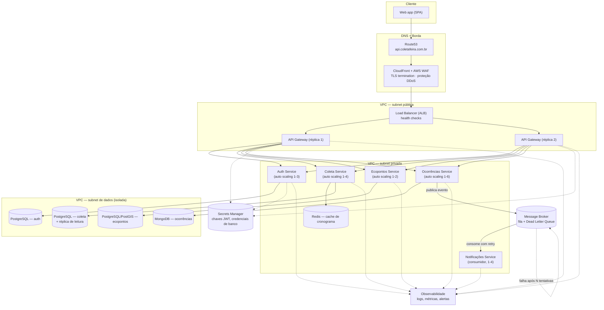

# Plataforma de Coleta de Resíduos Urbanos

**TDE — Sistemas Distribuídos (2026.2) · UNIFAN**
**Etapa 1 — Proposta e Arquitetura do Projeto** · Defesa em 21/09/2026
Docente: Prof. Rafael Levi Batista Costa

> Esta etapa não entrega código de produção. Este README documenta a proposta
> técnica completa exigida para a defesa: domínio, regras de negócio,
> arquitetura, segurança, escalonamento, resiliência, DNS, cronograma e
> divisão de papéis. Um protótipo REST simplificado (servidor Node.js +
> cliente Python) já foi construído como prova de conceito do domínio e está
> em [`/prototipo`](./prototipo) — ele valida o contrato de dados, não a
> arquitetura final descrita abaixo.

## Sumário

1. [Escolha do projeto (domínio)](#1-escolha-do-projeto-domínio)
2. [Diferencial da solução](#2-diferencial-da-solução)
3. [Regras de negócio](#3-regras-de-negócio)
4. [Arquitetura e system design](#4-arquitetura-e-system-design)
5. [Segurança](#5-segurança)
6. [Escalonamento](#6-escalonamento)
7. [Tolerância a falhas (resiliência)](#7-tolerância-a-falhas-resiliência)
8. [DNS](#8-dns)
9. [Repositório](#9-repositório)
10. [Cronograma](#10-cronograma)
11. [Papéis da equipe](#11-papéis-da-equipe)

---

## 1. Escolha do projeto (domínio)

**Problema:** o cronograma de coleta de resíduos urbanos em Feira de Santana
é comunicado por meios informais e dispersos (cartazes, grupos de WhatsApp,
ligações à prefeitura). O cidadão não sabe com precisão quando o caminhão
passa no seu bairro — o que gera exposição prolongada de resíduos na via
pública — e a prefeitura não tem um canal digital único para receber e
rastrear reclamações sobre falhas no serviço.

**Proposta de valor:** uma plataforma pública, web responsiva, que centraliza
três jornadas:

1. **Consultar** — cronograma de coleta domiciliar e seletiva do bairro, com
   cálculo automático da próxima coleta e status operacional do dia.
2. **Localizar** — ecopontos de entrega voluntária, filtráveis por tipo de
   material aceito.
3. **Reportar** — abertura de ocorrência (coleta não realizada, acúmulo
   irregular, container danificado, descarte de entulho) com protocolo de
   acompanhamento.

**Personas:**

| Persona | Necessidade |
|---|---|
| Cidadão | Saber quando colocar o lixo na rua; reportar falhas |
| Operador da concessionária | Ver ocorrências abertas no seu setor, atualizar status |
| Gestor municipal | Indicadores agregados: ocorrências por bairro, tempo médio de resolução |

**Por que é um problema de sistemas distribuídos genuíno:** as três jornadas
têm perfis de carga muito diferentes — leitura pesada e previsível (Coleta),
busca geoespacial (Ecopontos) e escrita com picos súbitos e imprevisíveis
(Ocorrências, disparadas por eventos externos como temporais). Modelar isso
como uma aplicação única obrigaria a escalar tudo junto e concentraria risco
num único ponto de falha — o que justifica, tecnicamente, a arquitetura
descrita na seção 4.

## 2. Diferencial da solução

Ao contrário de uma central telefônica ou de um formulário estático:

- O status da coleta é **calculado em tempo real** a partir da data/hora da
  consulta e do cronograma fixo do bairro — nunca um valor estático que
  desatualiza.
- Ocorrências abertas disparam um **fluxo assíncrono de notificação** ao
  cidadão quando o status muda, via mensageria — ele não precisa voltar a
  consultar o protocolo manualmente.
- A arquitetura foi desenhada para **escalar seletivamente**: um pico de
  ocorrências após um temporal não degrada a consulta de cronograma, porque
  são serviços, bancos e políticas de auto scaling independentes.

## 3. Regras de negócio

- Cada bairro tem exatamente um cronograma de coleta domiciliar e um de
  coleta seletiva, definidos por dias fixos da semana e turno (matutino,
  vespertino, noturno).
- A próxima coleta é sempre calculada a partir da data corrente do servidor
  — nunca armazenada como valor fixo.
- Status operacional do dia segue a máquina de estados
  `AGENDADA → EM_ROTA → CONCLUIDA` (ou `SEM_COLETA`), transicionando
  conforme o horário do turno.
- Uma ocorrência só pode ser aberta para um bairro cadastrado e com um tipo
  dentre os quatro suportados.
- Toda ocorrência recebe um protocolo único (`OC-<ano>-<sequencial>`) e
  nasce no status `ABERTA`.
- Mudança de status de uma ocorrência (`ABERTA → EM_ANALISE → RESOLVIDA`)
  publica um evento assíncrono para notificar o solicitante — o serviço que
  registra a ocorrência **não** envia a notificação diretamente (separação
  de responsabilidades, ver seção 4).
- Ecopontos podem aceitar múltiplos materiais; a busca por material é um
  filtro, não uma segmentação exclusiva.

**Fora de escopo nesta fase:** app mobile nativo, roteirização de caminhões,
pagamento/cobrança, integração com sistemas legados da prefeitura.

## 4. Arquitetura e system design

### 4.1 Modelagem dos nós — monólito modular vs. microsserviços

| | Monólito modular | Microsserviços (escolhido) |
|---|---|---|
| Complexidade operacional | Baixa | Alta, compensada pelo aprendizado do TDE |
| Isolamento de falha | Um bug derruba tudo | Falha de um serviço não derruba os demais |
| Escalonamento seletivo | Escala a aplicação inteira | Escala só o serviço sob pressão |
| Ownership da squad | Difícil paralelizar | 1 serviço por integrante |

Optamos por **microsserviços orientados a domínio** (DDD, *bounded
contexts*) pelo motivo técnico já explicado na seção 1: perfis de carga e
dado incompatíveis entre os domínios.

### 4.2 Serviços (nós) do sistema

| Serviço | Responsabilidade | Dado próprio | Protocolo exposto |
|---|---|---|---|
| **API Gateway** | Ponto único de entrada, autenticação de borda, rate limiting, roteamento | — (stateless) | HTTPS/REST |
| **Auth Service** | Emissão/validação de JWT, cadastro de usuários (cidadão/operador/gestor) | PostgreSQL | REST interno |
| **Coleta Service** | Cronograma por bairro, cálculo da próxima coleta e status do dia | PostgreSQL | REST |
| **Ecopontos Service** | Cadastro e busca geoespacial de ecopontos | PostgreSQL + PostGIS | REST |
| **Ocorrências Service** | Abertura e consulta de ocorrências, publica evento de mudança de status | MongoDB | REST + eventos |
| **Notificações Service** | Consome eventos e envia e-mail/SMS ao cidadão | — (stateless) | Consumidor de fila |

Cada serviço é **dono exclusivo do seu dado** (*database per service*) —
nenhum serviço acessa a base de outro diretamente, só por API.

### 4.3 Protocolos de comunicação entre serviços

- **Síncrono (REST/HTTPS)**: cliente ↔ Gateway ↔ serviços de consulta
  (Coleta, Ecopontos, Auth) — o usuário espera resposta na hora.
- **Assíncrono (mensageria)**: Ocorrências → Notificações. Criar uma
  ocorrência não espera o envio de e-mail; se Notificações cair, a fila
  retém as mensagens.
- Contrato OpenAPI por serviço síncrono + schema de evento JSON versionado
  para a fila.

### 4.4 Desenho de recursos computacionais, banco de dados e nuvem



Segmentação em três camadas de rede (VPC): **subnet pública** (só Load
Balancer e Gateway têm IP exposto), **subnet privada** (serviços de negócio,
sem acesso direto da internet) e **subnet de dados isolada** (bancos, acesso
restrito só aos serviços donos).

**Recursos planejados por camada:**

| Recurso | Ferramenta/serviço | Finalidade |
|---|---|---|
| Orquestração de containers | ECS (ou Kubernetes/EKS) | Deploy e auto scaling por serviço |
| Bancos gerenciados | RDS (PostgreSQL), DocumentDB/MongoDB Atlas | Persistência por serviço, backups automáticos |
| Cache | ElastiCache (Redis) | Cache de leitura do Coleta Service |
| Mensageria | SQS + SNS (ou RabbitMQ gerenciado) | Fila principal + Dead Letter Queue |
| CDN + WAF | CloudFront + AWS WAF | Borda, cache estático, proteção contra ataques |
| Segredos | AWS Secrets Manager | Credenciais de banco, chave de assinatura JWT |
| Observabilidade | CloudWatch (ou Prometheus + Grafana) | Logs, métricas, alertas, gatilhos de auto scaling |

## 5. Segurança

- **Autenticação/autorização**: Auth Service emite JWT de curta duração
  (access token, 15 min) + refresh token (7 dias, revogável). O API Gateway
  valida o token em toda requisição antes de rotear — os serviços internos
  não reimplementam autenticação, apenas confiam no cabeçalho assinado pelo
  Gateway (*trusted subsystem*). Tokens carregam `role`
  (`cidadao`/`operador`/`gestor`); `POST /ocorrencias/{id}/status` exige
  `operador` ou `gestor`.
- **Gestão segura de segredos**: nenhuma credencial em variável de ambiente
  commitada ou `.env` versionado — tudo em Secrets Manager (ou Vault),
  injetado em runtime no container. Rotação automática a cada 90 dias.
- **Proteção de borda**: WAF na CDN filtrando OWASP Top 10 (SQL injection,
  XSS, bots) antes de qualquer requisição alcançar o Load Balancer. Rate
  limiting por IP no API Gateway contra abuso do `POST /ocorrencias`.
- **Regras de firewall e segmentação de rede**: Security Groups
  restringindo a subnet de dados a receber tráfego *apenas* das subnets de
  serviço correspondentes (ex: só Coleta Service fala com o Postgres de
  coleta); nenhum banco tem IP público.
- **Transporte**: TLS obrigatório ponta a ponta (HTTPS externo e mTLS
  interno entre Gateway e serviços em versões futuras).

## 6. Escalonamento

- Cada serviço roda em **containers** (Docker), orquestrados (ECS/Kubernetes),
  permitindo escalonamento **horizontal** independente por serviço.
- **Auto scaling** com política adequada a cada carga:
  - Coleta/Ecopontos (leitura pesada, previsível): CPU e latência média.
  - Ocorrências (picos súbitos, ex: após temporal): profundidade da fila de
    entrada e taxa de erro 5xx.
  - Notificações: tamanho da fila de mensagens pendentes.
- **Cache** (Redis) na frente do Coleta Service absorve a maior parte das
  leituras de cronograma antes mesmo de escalar réplicas.
- **Read replicas** no PostgreSQL de Coleta para picos de leitura sem
  sobrecarregar a instância primária.
- Escalonamento **vertical** reservado para os bancos de dados, onde
  aumentar instância é mais simples que fragmentar dados nesta fase.

## 7. Tolerância a falhas (resiliência)

- **Circuit breaker** no API Gateway: se um serviço interno começa a falhar
  acima de um limiar, o Gateway para de chamá-lo temporariamente e retorna
  erro rápido ao cliente, evitando falha em cascata.
- **Retries com backoff exponencial** no consumo da fila pelo Notificações
  Service — falha transitória de envio de e-mail não perde a mensagem.
- **Dead Letter Queue (DLQ)**: mensagens que falham após N tentativas vão
  para uma fila separada, para investigação manual, sem travar as demais.
- **Backup e recuperação**: snapshots automáticos diários dos bancos
  relacionais (retenção de 7 dias) e backup contínuo do MongoDB; estratégia
  **multi-AZ** nos bancos críticos (Ocorrências, Auth) para failover
  automático em caso de indisponibilidade de uma zona.
- **Health checks** no Load Balancer removendo automaticamente da rotação
  qualquer réplica de serviço que pare de responder.

## 8. DNS

- Domínio raiz: `coletafeira.com.br`.
- Subdomínios por finalidade:
  - `api.coletafeira.com.br` → API Gateway (tráfego de produção)
  - `admin.coletafeira.com.br` → painel do operador/gestor
  - `docs.coletafeira.com.br` → documentação OpenAPI/Swagger pública
  - `status.coletafeira.com.br` → página de status do sistema
- Gerenciado via **Route53**, com **TTL baixo** (60s) para permitir troca
  rápida de destino em caso de incidente.
- Roteamento com **política de failover**: se a região primária falhar o
  health check, o DNS passa a resolver para a região secundária
  automaticamente, sem intervenção manual.
- Internamente, os serviços **não** se descobrem por IP fixo: usam
  *service discovery* interno do orquestrador (DNS interno do
  ECS/Kubernetes) — uma réplica pode morrer e subir em outro host sem que
  nenhum outro serviço precise ser reconfigurado.

## 9. Repositório

### Estrutura (projeto final)

```
coleta-residuos-plataforma/
├── README.md                     # este arquivo — toda a proposta técnica
├── .gitignore
├── .github/
│   ├── CODEOWNERS                # dono de cada serviço, revisão obrigatória
│   ├── PULL_REQUEST_TEMPLATE.md
│   ├── ISSUE_TEMPLATE/
│   └── workflows/                # CI/CD (lint, testes, build) — Etapa 2+
├── services/                     # um diretório por bounded context
│   ├── api-gateway/{README.md, src/}
│   ├── auth-service/{README.md, src/}
│   ├── coleta-service/{README.md, src/}
│   ├── ecopontos-service/{README.md, src/}
│   ├── ocorrencias-service/{README.md, src/}
│   └── notificacoes-service/{README.md, src/}
├── infra/                        # infraestrutura como código
│   ├── README.md
│   ├── terraform/                # provisionamento (VPC, ECS, RDS...) — Etapa futura
│   └── docker-compose/           # ambiente local para dev — Etapa futura
└── prototipo/                    # PoC já funcional (Node.js + Python)
```

Cada `services/<nome>/` já existe como *bounded context* isolado (README
descrevendo responsabilidade, dado próprio e contrato de API, mais um `src/`
vazio) — é o esqueleto sobre o qual o código será escrito nas próximas
entregas, sem misturar responsabilidades entre serviços desde já.

### Governança e branches

- `main` — protegida, só recebe merge via Pull Request revisado por outro
  integrante.
- `develop` — integração contínua do trabalho da squad.
- `feature/<servico>-<descricao>` — uma branch por tarefa, a partir de
  `develop`.
- Commits seguem [Conventional Commits](https://www.conventionalcommits.org/)
  (`feat:`, `fix:`, `docs:`, `chore:`).
- Todo Pull Request usa o template em
  [`.github/PULL_REQUEST_TEMPLATE.md`](./.github/PULL_REQUEST_TEMPLATE.md) e
  exige revisão de ao menos um `CODEOWNER` do serviço alterado (ver
  [`.github/CODEOWNERS`](./.github/CODEOWNERS)).

## 10. Cronograma

| Etapa | Entrega | Data |
|---|---|---|
| **1 — Proposta e arquitetura** | Repositório organizado, documentação, diagrama | 21/09/2026 (defesa) |
| **2 — Contrato e serviços core** | OpenAPI de cada serviço; Coleta e Ecopontos implementados | a definir |
| **3 — Mensageria e assincronismo** | Ocorrências publicando eventos; Notificações consumindo fila com DLQ | a definir |
| **4 — Segurança e borda** | Auth Service (JWT); Gateway validando tokens; segredos fora do código | a definir |
| **5 — Observabilidade e resiliência** | Circuit breaker; health checks; dashboards | a definir |
| **6 — Entrega final** | Sistema integrado end-to-end; demonstração de escalonamento e failover | a definir |

### Marcos internos da squad (Etapa 1)

| Marco | Responsável | Status |
|---|---|---|
| Escopo, regras de negócio e diferencial | [Integrante] | ✅ concluído |
| Modelagem dos nós e diagrama arquitetural | [Integrante] | ✅ concluído |
| Segurança, escalonamento, resiliência, DNS | [Integrante] | ✅ concluído |
| Organização do repositório e governança | [Integrante] | ✅ concluído |
| Ensaio da apresentação | Todos | ⏳ pendente |

## 11. Papéis da equipe

> **Preencher com os nomes reais antes da defesa de 21/09.** A avaliação é
> individualizada por integrante — cada linha precisa corresponder a uma
> pessoa que consiga defender sua parte na banca.

| Integrante | Papel principal | Serviço(s) sob responsabilidade | O que domina para a defesa |
|---|---|---|---|
| [Nome 1] | Arquitetura & Infraestrutura | API Gateway, infra (VPC, LB, DNS) | Modelagem de nós, escalonamento, DNS |
| [Nome 2] | Segurança | Auth Service | Autenticação/autorização, segredos, WAF, rede |
| [Nome 3] | Domínio — Coleta/Ecopontos | Coleta Service, Ecopontos Service | Regras de negócio, cache, read replicas |
| [Nome 4] | Domínio — Ocorrências & Resiliência | Ocorrências Service, Notificações Service | Mensageria, DLQ, circuit breaker, backup |

**Responsabilidades transversais**

- **Documentação**: revisão coletiva antes de cada entrega.
- **Governança do repositório** (branches, PR review, CODEOWNERS):
  [Integrante] mantém o `.github/` atualizado.
- **Ensaio da apresentação**: cada integrante apresenta a parte pela qual é
  responsável — a banca avalia individualmente, então ninguém apresenta a
  parte de outro colega no dia.
- Todo Pull Request precisa ser aberto pela pessoa responsável pelo serviço
  correspondente e revisado por pelo menos um outro integrante.
