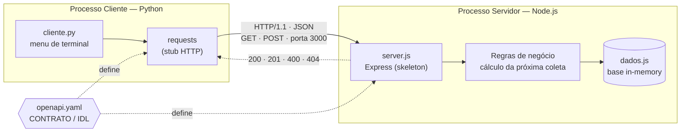

# Protótipo (PoC)

Prova de conceito construída antes da definição da arquitetura de
microsserviços, para validar o domínio e o contrato de dados de Coleta e
Ocorrências. É um monólito simples (Node.js + Express) com cliente Python —
**não representa a arquitetura final**, descrita no README raiz do
repositório.

Útil para:
- validar as regras de negócio de cronograma e cálculo de próxima coleta;
- servir de ponto de partida para o `coleta-service` na Etapa 2.

Instruções de execução abaixo (conteúdo original deste protótipo).

---

# API Pública de Coleta de Resíduos Urbanos

**TDE Parte 1 — Implementação Prática de Middlewares e IDLs**
Disciplina: Sistemas Distribuídos (2026.2) · Docente: Prof. Rafael Levi Batista Costa · UNIFAN
Opção escolhida: **2 — REST (OpenAPI/Swagger)**

## Sobre o projeto

Sistema distribuído heterogêneo para consulta pública do serviço de coleta de resíduos
urbanos de Feira de Santana - BA. O cidadão consulta o cronograma de coleta do seu
bairro, localiza ecopontos e registra ocorrências (acúmulo irregular, coleta não
realizada).

| Componente | Linguagem | Papel |
|---|---|---|
| `servidor-node/` | Node.js + Express | Servidor REST, porta 3000 |
| `cliente-python/` | Python + requests | Cliente de terminal (consumidor da API) |
| `openapi.yaml` | OpenAPI 3.0 | **IDL** — contrato entre os dois lados |

O único acoplamento entre cliente e servidor é o contrato `openapi.yaml`. O cliente
Python não sabe (e não precisa saber) que o servidor foi escrito em JavaScript — é
exatamente a **transparência de acesso** discutida em aula.

## Arquitetura



O contrato `openapi.yaml` é o único ponto de acoplamento: cliente e servidor são
processos independentes, em runtimes diferentes, que só se conhecem pelas rotas,
formatos e códigos de status descritos na IDL. Trocar o servidor Node por um servidor
Python (ou Go, ou Java) não exigiria uma linha de mudança no cliente — é a
**transparência de acesso** em funcionamento.

## Estrutura

```
coleta-residuos-api/
├── README.md
├── openapi.yaml              # IDL / contrato da API
├── servidor-node/
│   ├── package.json
│   ├── server.js             # rotas + regras de negócio
│   └── dados.js              # base de dados simulada (in-memory)
└── cliente-python/
    ├── requirements.txt
    └── cliente.py            # cliente de terminal com menu
```

## Como executar

### 1. Servidor (Node.js)

```bash
cd servidor-node
npm install
npm start
```

Saída esperada:

```
 Servidor Node.js ouvindo em http://localhost:3000
```

Documentação interativa (Swagger UI) em <http://localhost:3000/docs>.

### 2. Cliente (Python) — em outro terminal

```bash
cd cliente-python
python -m venv venv
source venv/bin/activate        # Windows: venv\Scripts\activate
pip install -r requirements.txt
python cliente.py
```

O menu oferece as seis operações da API. O terminal do servidor exibe o log de cada
requisição recebida — bom recurso para mostrar a integração funcionando na apresentação.

## Contrato da API (resumo)

| Método | Rota | Descrição |
|---|---|---|
| GET | `/bairros` | Lista bairros atendidos (filtro opcional `?zona=`) |
| GET | `/bairros/{id}` | Dados cadastrais de um bairro |
| GET | `/bairros/{id}/coleta` | Cronograma + cálculo da próxima coleta |
| GET | `/bairros/{id}/status` | Status da coleta do dia (AGENDADA / EM_ROTA / CONCLUIDA) |
| GET | `/ecopontos` | Pontos de entrega voluntária (filtro opcional `?material=`) |
| POST | `/ocorrencias` | Registra ocorrência e devolve protocolo (201 Created) |
| GET | `/ocorrencias/{protocolo}` | Consulta ocorrência pelo protocolo |

Códigos de status utilizados: `200` (sucesso), `201` (recurso criado),
`400` (dados inválidos), `404` (recurso inexistente).

### Exemplo de resposta — `GET /bairros/BR001/coleta`

```json
{
  "id_bairro": "BR001",
  "bairro": "Centro",
  "consultado_em": "2026-09-18T20:24:34.506Z",
  "coleta_domiciliar": {
    "dias_semana": ["segunda", "quarta", "sexta"],
    "turno": "noturno",
    "proxima_coleta": "2026-09-18",
    "dias_restantes": 0
  },
  "coleta_seletiva": {
    "dias_semana": ["terca"],
    "turno": "matutino",
    "proxima_coleta": "2026-09-22",
    "dias_restantes": 4
  }
}
```

## Testes rápidos via curl

```bash
curl http://localhost:3000/bairros
curl http://localhost:3000/bairros/BR001/coleta
curl "http://localhost:3000/ecopontos?material=oleo"
curl -X POST http://localhost:3000/ocorrencias \
  -H "Content-Type: application/json" \
  -d '{"id_bairro":"BR003","tipo":"acumulo_irregular","descricao":"Resíduos acumulados há 3 dias","solicitante":"Lucas"}'
```

## Troubleshooting

- **`ConnectionError` no cliente**: o servidor Node precisa estar rodando antes. Confira
  se a porta 3000 não está ocupada (`lsof -i :3000`) ou bloqueada pelo firewall local.
- **`ModuleNotFoundError: requests`**: o ambiente virtual não foi ativado antes do
  `pip install`.
- **Swagger UI não abre**: as dependências `swagger-ui-express` e `yamljs` são opcionais;
  a API funciona normalmente sem elas.
- **Dados sumiram após reiniciar**: as ocorrências ficam em memória, por decisão de
  escopo. Reiniciar o servidor zera a lista.
